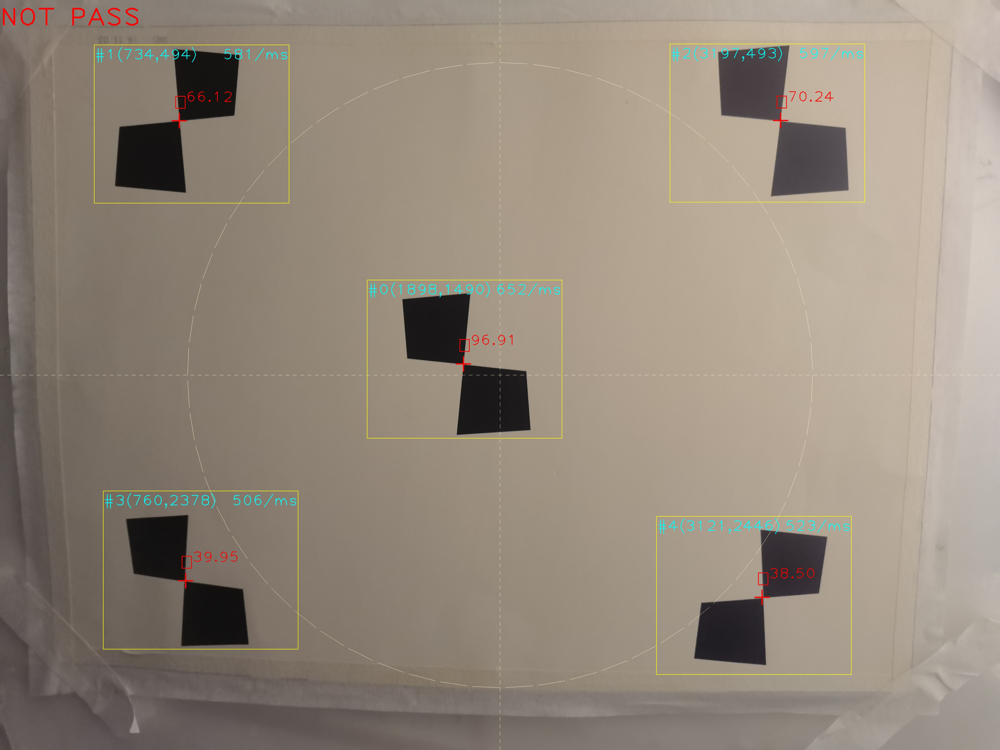
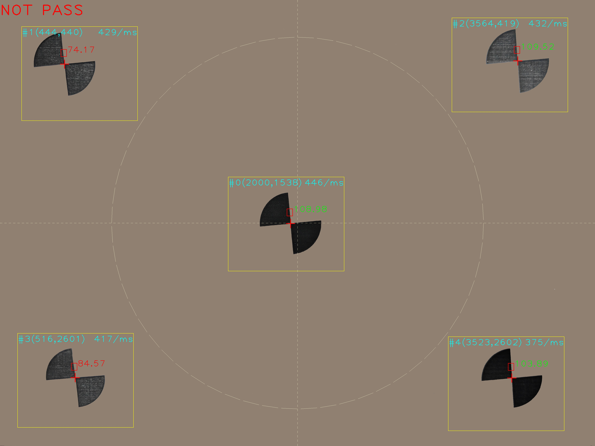

# libsfr
通过opencv识别ROI区域计算镜头清晰度

```
#include <stdio.h>
#include <stdlib.h>
#include <Sfr/sfr.h>
#pragma comment(lib, "sfr.lib")
 
int main(int argc, char** argv)
{
	//计算频率在0.125的sfr
	sfr::Algorithm alg;
	sfr::Area area[5];
#if 1
	//中心
	area[0].x = 1503;
	area[0].y = 1146;
	//左上
	area[1].x = 385;
	area[1].y = 183;
 
	//右上
	area[2].x = 2743;
	area[2].y = 179;
 
	//左下
	area[3].x = 422;
	area[3].y = 2010;
 
	//右下
	area[4].x = 2688;
	area[4].y = 2114;
 
	for (int i = 0; i < 5; ++i) {
		area[i].width = 800;
		area[i].height = 650;
		area[i].locateType = sfr::BLACK_TRAPEZOID_WITH_WHITE_BACKGROUND;
		area[i].roi.xOffset = -15;
		area[i].roi.yOffset = -100;
		area[i].roi.width = 40;
		area[i].roi.height = 50;
		area[i].threshold = 85;
		area[i].denoisePixel = 5;
	}
 
	sfr::Data data;
	sfr::Enable enable;
	enable.drawFovp = true;
	enable.drawLocateCenter = true;
	enable.drawResultPass = true;
 
	sfr::Paint paint;
	paint.textScale = 4.3;
	paint.textThickness = 2;
	paint.roiRectThickness = 2;
	paint.areaRectThickness = 2;
	paint.locateLineThickness = 4;
	paint.locateLineLength = 30;
	paint.locateLineColor = CV_RGB(255, 0, 0);
 
	cv::Mat mat = cv::imread("img_trapezoid.jpg");
	alg.initialize(area, &data, &enable, &paint);
	for (int i = 0; i < 5; ++i) {
		alg.getCrossLineCenter(i, mat);
		alg.calculateRoi(i);
		alg.calculateSfr(i, mat);
		alg.putText(i, mat);
	}
	cv::imwrite("img_trapezoid_sfr.jpg", mat);
#else
	//中心
	area[0].x = 1570;
	area[0].y = 1218;
	//左上
	area[1].x = 148;
	area[1].y = 182;
 
	//右上
	area[2].x = 3110;
	area[2].y = 122;
 
	//左下
	area[3].x = 120;
	area[3].y = 2295;
 
	//右下
	area[4].x = 3085;
	area[4].y = 2318;
 
	for (int i = 0; i < 5; ++i) {
		area[i].width = 800;
		area[i].height = 650;
		area[i].locateType = sfr::BLACK_SECTOR_WITH_WHITE_BACKGROUND;
		area[i].roi.xOffset = -25;
		area[i].roi.yOffset = -100;
		area[i].roi.width = 40;
		area[i].roi.height = 50;
		area[i].threshold = 85;
		area[i].denoisePixel = 5;
	}
 
	sfr::Data data;
	sfr::Enable enable;
	enable.drawFovp = true;
	enable.drawLocateCenter = true;
	enable.drawResultPass = true;
 
	sfr::Paint paint;
	paint.textScale = 4.3;
	paint.textThickness = 2;
	paint.roiRectThickness = 2;
	paint.areaRectThickness = 2;
	paint.locateLineThickness = 4;
	paint.locateLineLength = 30;
	paint.locateLineColor = CV_RGB(255, 0, 0);
 
	cv::Mat mat = cv::imread("img_sector.jpg");
	alg.initialize(area, &data, &enable, &paint);
	for (int i = 0; i < 5; ++i) {
		alg.getCrossLineCenter(i, mat);
		alg.calculateRoi(i);
		alg.calculateSfr(i, mat);
		alg.putText(i, mat);
	}
	cv::imwrite("img_sector_sfr.jpg", mat);
#endif
	system("pause");
	return 0;
}
```






